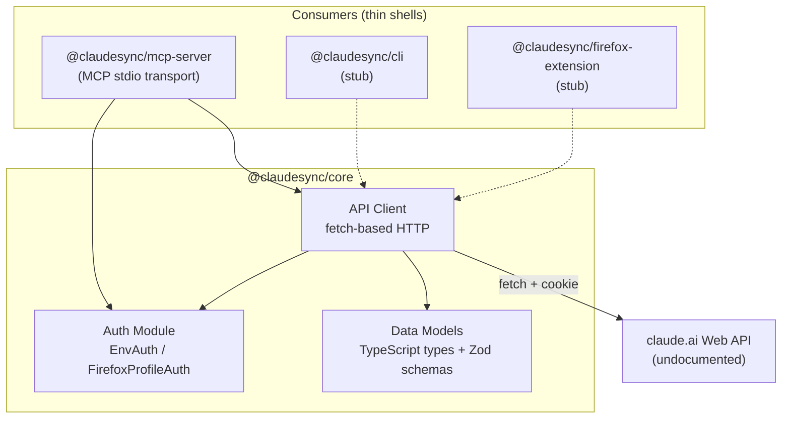

# ClaudeSync Monorepo Design

**Date:** 2026-03-10
**Status:** Approved
**Author:** Wes Gilleland / Infinite Room Labs LLC

---

## Summary

ClaudeSync is a TypeScript monorepo wrapping the undocumented claude.ai web API. The initial deliverable is a read-only MCP server exposing conversation listing and retrieval. The SDK is designed as a shared core consumed by multiple thin shells (MCP server, CLI, Firefox extension).

## Architecture

Three-layer design:

1. **@claudesync/core** -- TypeScript SDK handling auth, HTTP client, and data models
2. **Consumers** -- Thin shells (MCP server, CLI, extension) that import core
3. **claude.ai Web API** -- Undocumented HTTP API using cookie-based auth



## Technology Stack

| Component | Choice | Rationale |
|-----------|--------|-----------|
| Runtime | Bun | Native TS, fast, built-in workspace support |
| Monorepo | Bun workspaces | Lightweight; Turborepo added later if needed |
| MCP SDK | @modelcontextprotocol/sdk | Official SDK, stdio transport |
| HTTP client | Standard fetch | No TLS impersonation initially; layer in later if blocked |
| Validation | Zod | Runtime schema validation for undocumented API responses |
| Language | TypeScript | Strict mode |

## Package Structure

```
claudesync/
├── packages/
│   ├── core/                    # @claudesync/core
│   │   ├── src/
│   │   │   ├── auth/
│   │   │   │   ├── types.ts         # AuthProvider interface
│   │   │   │   ├── env.ts           # EnvAuth (CLAUDE_AI_COOKIE)
│   │   │   │   └── firefox.ts       # FirefoxProfileAuth (cookies.sqlite)
│   │   │   ├── client/
│   │   │   │   ├── client.ts        # ClaudeSyncClient class
│   │   │   │   └── endpoints.ts     # URL builders
│   │   │   ├── models/
│   │   │   │   └── types.ts         # Organization, Conversation, etc.
│   │   │   └── index.ts
│   │   └── package.json
│   ├── mcp-server/              # @claudesync/mcp-server
│   │   ├── src/
│   │   │   ├── server.ts            # MCP server setup + tool registration
│   │   │   └── index.ts             # Entry point (stdio transport)
│   │   └── package.json
│   ├── cli/                     # @claudesync/cli (stub)
│   │   └── package.json
│   └── extension/               # @claudesync/firefox-extension (stub)
│       └── package.json
├── scripts/
│   └── extract-cookie.ts        # Helper to extract cookie from Firefox profile
├── package.json                 # Bun workspace root
├── tsconfig.base.json
└── CLAUDE.md
```

## Authentication

Two strategies, both implementing a shared `AuthProvider` interface:

### Strategy 1: Environment Variables (EnvAuth)

User sets `CLAUDE_AI_COOKIE` (required) and optionally `CLAUDE_AI_USER_AGENT`. Simplest path -- user grabs cookie from browser DevTools once.

### Strategy 2: Firefox Profile Auto-Read (FirefoxProfileAuth)

Reads cookies directly from Firefox's `cookies.sqlite` database (`~/.mozilla/firefox/<profile>/cookies.sqlite`). Opens read-only, works while browser is running. User-Agent derived from Firefox version.

### Helper Script

`scripts/extract-cookie.ts` -- runnable Bun script that reads Firefox's cookies.sqlite and prints the cookie string. Users run it once and set the env var, or use FirefoxProfileAuth for auto-discovery.

```typescript
interface AuthProvider {
  getHeaders(): Promise<Record<string, string>>;
  getOrganizationId(): Promise<string>;
}
```

## API Client (v1 -- Read-Only)

### Known Endpoints

From reverse-engineering the reference implementations (st1vms/unofficial-claude-api):

| Verb | Path | Purpose |
|------|------|---------|
| GET | /api/organizations | Fetch org UUIDs |
| GET | /api/organizations/{org_id}/chat_conversations | List all chats |
| GET | /api/organizations/{org_id}/chat_conversations/{chat_id} | Get full conversation |

### Client Interface

```typescript
interface ClaudeSyncClient {
  listOrganizations(): Promise<Organization[]>;
  listConversations(orgId: string): Promise<ConversationSummary[]>;
  getConversation(orgId: string, chatId: string): Promise<Conversation>;
}
```

## MCP Tools (v1)

| Tool | Description | Parameters |
|------|-------------|------------|
| list_organizations | Get available org UUIDs and names | none |
| list_conversations | List conversations with metadata | orgId (optional -- auto-detected) |
| get_conversation | Get full conversation with all messages | conversationId, orgId (optional) |

## Data Models

Zod schemas for runtime validation. Key types:

```typescript
interface Organization {
  uuid: string;
  name: string;
}

interface ConversationSummary {
  uuid: string;
  name: string;
  model: string | null;
  created_at: string;
  updated_at: string;
}

interface Conversation extends ConversationSummary {
  chat_messages: ChatMessage[];
}

interface ChatMessage {
  uuid: string;
  text: string;
  sender: 'human' | 'assistant';
  index: number;
  created_at: string;
  updated_at: string;
  attachments: Attachment[];
}
```

## Deferred Scope

These are explicitly out of scope for v1 but part of the broader ClaudeSync vision:

- **Write operations**: create_conversation, send_message, delete_conversation
- **Projects API**: Endpoint discovery needed
- **Artifact parsing**: Extract artifacts from message text, build version timelines
- **Git export engine**: Convert conversations + artifacts into git repositories
- **Streaming**: SSE response parsing for real-time message streaming
- **Search**: Conversation search (endpoint unknown)
- **TLS impersonation**: curl_cffi-style fingerprinting if standard fetch gets blocked

## Reference Material

- PRD: `ideas/prds/PRD-claudesync.md`
- Reference implementation: `~/projects/claude-web-api-research/unofficial-claude-api/` (st1vms/unofficial-claude-api v0.3.3, Python)
- Abandoned reference: `~/projects/claude-web-api-research/Claude-API/` (KoushikNavuluri/Claude-API, Python, reference-only)
- API library audit: `ideas/references/unofficial-claude-web-api-libraries.md`

## Open Questions

1. **API response shapes** -- Need to capture real API responses from DevTools to confirm field names and structure. The reference implementation's parsing may be outdated.
2. **Rate limiting** -- The reference detects `resets_at` in error responses. We need to handle this gracefully in the MCP server (return error with wait time).
3. **Pagination** -- Does `list_conversations` paginate? Unknown. Need to test with accounts that have many conversations.
4. **Anti-bot measures** -- Does claude.ai block standard fetch requests? Need empirical testing before adding TLS impersonation complexity.
