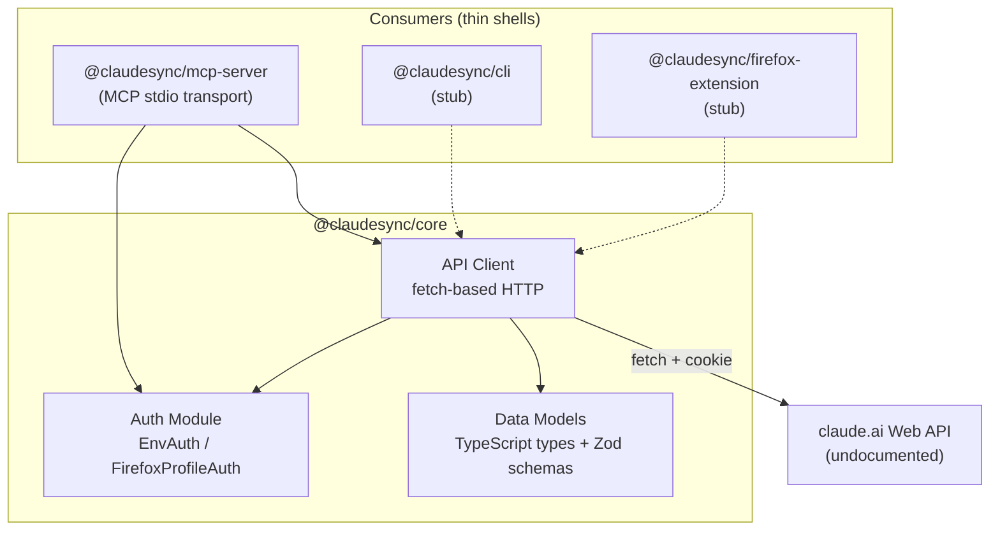

# ClaudeSync Monorepo Design

**Date:** 2026-03-10 (updated 2026-03-14)
**Status:** Approved -- updated with spike findings
**Author:** Wes Gilleland / Infinite Room Labs LLC

---

## Summary

ClaudeSync is a TypeScript monorepo wrapping the undocumented claude.ai web API. The initial deliverable is a read-only MCP server exposing conversation listing and retrieval. The SDK is designed as a shared core consumed by multiple thin shells (MCP server, CLI, Firefox extension).

## Architecture

Three-layer design:

1. **@claudesync/core** -- TypeScript SDK handling auth, HTTP client, and data models
2. **Consumers** -- Thin shells (MCP server, CLI, extension) that import core
3. **claude.ai Web API** -- Undocumented HTTP API using cookie-based auth



## Technology Stack

| Component | Choice | Rationale |
|-----------|--------|-----------|
| Runtime | Node.js (v25+) | **Changed from Bun** -- Bun's TLS fingerprint (BoringSSL) is blocked by Cloudflare on claude.ai (403). Node.js v25's undici/OpenSSL fingerprint passes. Confirmed via CLI testing 2026-03-14. |
| Package manager | pnpm | Fast, disk-efficient, workspace support |
| Monorepo | pnpm workspaces | Lightweight; Turborepo added later if needed |
| MCP SDK | @modelcontextprotocol/sdk | Official SDK, stdio transport |
| HTTP client | Node.js native fetch | No TLS impersonation needed -- Node.js passes Cloudflare natively |
| Validation | Zod | Runtime schema validation for undocumented API responses |
| Language | TypeScript | Strict mode, ESM |

## Package Structure

```
claudesync/
├── packages/
│   ├── core/                    # @claudesync/core
│   │   ├── src/
│   │   │   ├── auth/
│   │   │   │   ├── types.ts         # AuthProvider interface
│   │   │   │   ├── env.ts           # EnvAuth (CLAUDE_AI_COOKIE)
│   │   │   │   └── firefox.ts       # FirefoxProfileAuth (cookies.sqlite)
│   │   │   ├── client/
│   │   │   │   ├── client.ts        # ClaudeSyncClient class
│   │   │   │   └── endpoints.ts     # URL builders
│   │   │   ├── models/
│   │   │   │   └── types.ts         # Organization, Conversation, etc.
│   │   │   └── index.ts
│   │   └── package.json
│   ├── mcp-server/              # @claudesync/mcp-server
│   │   ├── src/
│   │   │   ├── server.ts            # MCP server setup + tool registration
│   │   │   └── index.ts             # Entry point (stdio transport)
│   │   └── package.json
│   ├── cli/                     # @claudesync/cli (stub)
│   │   └── package.json
│   └── extension/               # @claudesync/firefox-extension (stub)
│       └── package.json
├── scripts/
│   └── extract-cookie.ts        # Helper to extract cookie from browser profile
├── Dockerfile                   # Multi-stage build (Node.js v25+)
├── .github/
│   └── workflows/
│       └── ci.yml               # Build, test, lint, Docker image
├── package.json                 # pnpm workspace root
├── pnpm-workspace.yaml
├── tsconfig.base.json
└── CLAUDE.md
```

## Authentication

Two strategies, both implementing a shared `AuthProvider` interface.

**Spike findings (2026-03-14):** Auth is still cookie-based. The session cookie is httpOnly (invisible to JavaScript but readable from `cookies.sqlite`). Visible cookies include `anthropic-device-id` (device identifier), `lastActiveOrg` (last used org UUID), and `ajs_user_id` (analytics). No evidence of token-based auth, PKCE, or OAuth flows.

### Strategy 1: Environment Variables (EnvAuth)

User sets `CLAUDE_AI_COOKIE` (required) and optionally `CLAUDE_AI_USER_AGENT`. Simplest path -- user grabs cookie from browser DevTools once.

### Strategy 2: Firefox Profile Auto-Read (FirefoxProfileAuth)

Reads cookies directly from Firefox's `cookies.sqlite` database (`~/.mozilla/firefox/<profile>/cookies.sqlite`). Opens read-only, works while browser is running. User-Agent derived from Firefox version. The httpOnly session cookie is accessible via file read (the httpOnly flag only restricts browser JS, not direct file access).

### Helper Script

`scripts/extract-cookie.ts` -- runnable script that reads Firefox's cookies.sqlite (or Chrome's encrypted cookies via helper) and prints the cookie string. Users run it once and set the env var, or use FirefoxProfileAuth for auto-discovery.

```typescript
interface AuthProvider {
  getHeaders(): Promise<Record<string, string>>;
  getOrganizationId(): Promise<string>;
}
```

## API Client (v1 -- Read-Only)

### Known Endpoints

Confirmed via technical spike (2026-03-14). See `docs/spike-results/findings.md` for full details.

#### Core (v1 scope)

| Verb | Path | Purpose | Paginated? |
|------|------|---------|------------|
| GET | `/api/bootstrap` | SPA initialization -- account, feature flags | No |
| GET | `/api/account` | User profile, memberships, settings | No |
| GET | `/api/organizations` | List orgs with full settings + capabilities | No |
| GET | `/api/organizations/{org}/chat_conversations` | List ALL conversations (no pagination) | **No** |
| GET | `/api/organizations/{org}/chat_conversations/{id}` | Full conversation with all messages | No |
| GET | `/api/organizations/{org}/conversation/search?query={q}&n={limit}` | Full-text search | Via `n` param |

#### Projects (v1 scope -- endpoints now known)

| Verb | Path | Purpose |
|------|------|---------|
| GET | `/api/organizations/{org}/projects` | List all projects |
| GET | `/api/organizations/{org}/projects/{id}` | Single project detail |
| GET | `/api/organizations/{org}/projects/{id}/docs` | Knowledge files (full content inline) |
| GET | `/api/organizations/{org}/projects/{id}/files` | Uploaded files |
| GET | `/api/organizations/{org}/projects/{id}/conversations` | Project-scoped conversation list |

#### Artifacts (v1 scope -- wiggle filesystem)

| Verb | Path | Purpose |
|------|------|---------|
| GET | `/api/organizations/{org}/conversations/{id}/wiggle/list-files` | List artifact files + metadata |
| GET | `/api/organizations/{org}/conversations/{id}/wiggle/download-file?path={path}` | Download artifact content |
| GET | `/api/organizations/{org}/artifacts/wiggle_artifact/{id}/manage/storage/info` | Artifact storage metadata |

#### Write Ops (deferred)

| Verb | Path | Purpose |
|------|------|---------|
| POST | `/api/organizations/{org}/chat_conversations` | Create conversation |
| DELETE | `/api/organizations/{org}/chat_conversations/{id}` | Delete conversation |
| POST | `/api/organizations/{org}/chat_conversations/{id}/completion` | Send message (SSE) |
| POST | `/api/{org}/upload` | Upload file attachment |

### Client Interface

```typescript
interface ClaudeSyncClient {
  // Bootstrap & Account
  getBootstrap(): Promise<BootstrapResponse>;
  getAccount(): Promise<Account>;

  // Organizations
  listOrganizations(): Promise<Organization[]>;

  // Conversations
  listConversations(orgId: string): Promise<ConversationSummary[]>;
  getConversation(orgId: string, chatId: string): Promise<Conversation>;
  searchConversations(orgId: string, query: string, limit?: number): Promise<SearchResponse>;

  // Projects
  listProjects(orgId: string): Promise<Project[]>;
  getProject(orgId: string, projectId: string): Promise<Project>;
  getProjectDocs(orgId: string, projectId: string): Promise<ProjectDoc[]>;
  getProjectConversations(orgId: string, projectId: string): Promise<ConversationSummary[]>;

  // Artifacts
  listArtifacts(orgId: string, conversationId: string): Promise<ArtifactListResponse>;
  downloadArtifact(orgId: string, conversationId: string, path: string): Promise<string>;
}
```

## MCP Tools (v1)

| Tool | Description | Parameters |
|------|-------------|------------|
| list_organizations | Get available org UUIDs and names | none |
| list_conversations | List conversations with metadata | orgId (optional -- auto-detected) |
| get_conversation | Get full conversation with all messages | conversationId, orgId (optional) |

## Data Models

Zod schemas for runtime validation. Updated from spike findings (2026-03-14). Full type definitions in the PRD.

```typescript
interface Organization {
  id: number;
  uuid: string;
  name: string;
  settings: OrgSettings;
  capabilities: string[];
  rate_limit_tier: string;
  billing_type: string;
  active_flags: string[];
  created_at: string;
  updated_at: string;
  // ... see PRD for full type
}

interface ConversationSummary {
  uuid: string;
  name: string;
  summary: string;
  model: string;
  created_at: string;
  updated_at: string;
  settings: ConversationSettings;
  is_starred: boolean;
  is_temporary: boolean;
  project_uuid: string | null;
  current_leaf_message_uuid: string;   // Active branch pointer
  project?: { uuid: string; name: string };
}

interface Conversation extends ConversationSummary {
  chat_messages: ChatMessage[];
}

interface ChatMessage {
  uuid: string;
  text: string;                        // Clean text -- NO artifact content
  sender: 'human' | 'assistant';
  index: number;
  created_at: string;
  updated_at: string;
  truncated: boolean;
  stop_reason?: string;
  parent_message_uuid: string;         // Tree structure for branching
  attachments: Attachment[];
  files_v2: FileV2[];
  sync_sources: SyncSource[];
}

interface Project {
  uuid: string;
  name: string;
  description: string;
  is_private: boolean;
  creator: { uuid: string; full_name: string };
  permissions: string[];
  docs_count: number;
  files_count: number;
  created_at: string;
  updated_at: string;
}

interface ArtifactFileMetadata {
  path: string;                        // e.g., "/mnt/user-data/outputs/file.md"
  size: number;
  content_type: string;
  created_at: string;
  custom_metadata: { filename: string };
}
```

## Deferred Scope

Updated after spike (2026-03-14). Projects API, artifact access, and search are now understood and moved to v1 scope.

Still deferred for v1:

- **Write operations**: create_conversation, send_message, delete_conversation
- **Streaming**: SSE response parsing for real-time message streaming
- **TLS impersonation**: Not needed for Node.js (confirmed working via CLI testing 2026-03-14). Only needed if switching runtimes -- Bun and curl are both blocked by Cloudflare.
- **Git export engine**: Convert conversations + artifacts into git repositories (v2 -- needs artifact client working first)

## Reference Material

- PRD: `ideas/prds/PRD-claudesync.md`
- Reference implementation: `~/projects/claude-web-api-research/unofficial-claude-api/` (st1vms/unofficial-claude-api v0.3.3, Python)
- Abandoned reference: `~/projects/claude-web-api-research/Claude-API/` (KoushikNavuluri/Claude-API, Python, reference-only)
- API library audit: `ideas/references/unofficial-claude-web-api-libraries.md`

## Open Questions

*Updated 2026-03-14 after technical spike and CLI testing.*

1. **API response shapes** -- **ANSWERED.** Full data models captured from live API responses. See Data Models section and `docs/spike-results/findings.md`.
2. **Rate limiting** -- The reference detects `resets_at` in error responses. We need to handle this gracefully in the MCP server (return error with wait time). Not tested in spike.
3. **Pagination** -- **ANSWERED.** No pagination exists. The conversation list endpoint returned 1,375 conversations in a single response. Design the SDK to handle pagination gracefully if it's added later.
4. **Anti-bot measures** -- **ANSWERED.** Cloudflare performs TLS fingerprinting. Node.js v25 (undici/OpenSSL) passes. Bun (BoringSSL) and curl (OpenSSL 3.0.13) are blocked with 403. A full browser User-Agent string is also required (any browser works, doesn't need to match session). Non-browser UAs like "ClaudeSync/0.1" are rejected.
5. **Wiggle artifact UUID derivation** -- How does the wiggle filesystem associate artifact files with specific conversation messages? The `created_at` timestamp correlates loosely, but there may be an explicit link via the `wiggle_artifact/{id}` UUID. Needs further investigation.
6. **UA validation** -- **ANSWERED.** claude.ai does NOT validate UA against the session. Any full browser UA string works (Chrome, Firefox, any version). Cloudflare rejects non-browser UAs but does not check consistency with the session cookie. Hardcoding a Chrome UA is sufficient. Session cookie name is `sessionKey` (httpOnly, 131 chars).
