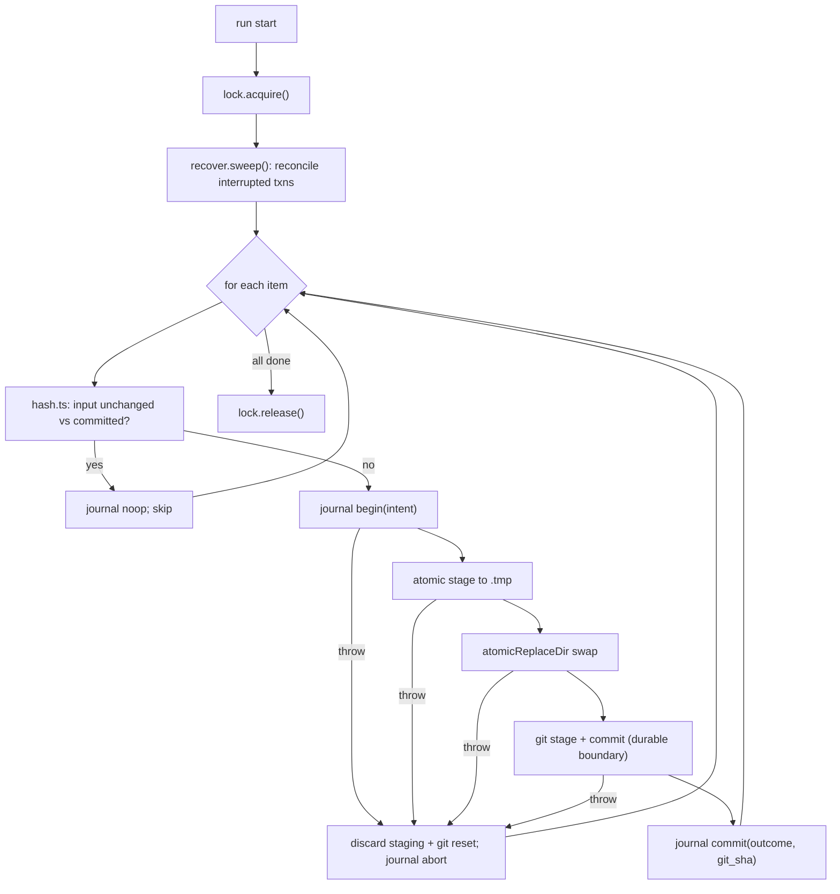

# Atomic, Auditable, Idempotent, Transactional Core Actions

- **Date:** 2026-06-28
- **Status:** Approved design (pre-implementation)
- **Source idea:** InfiniteRoomLabs/ideas idea 099.
- **Relationship:** Foundational reliability layer. The write-back design
  (`2026-06-28-write-back-sync-design.md`) is re-expressed on top of this; the two
  remain separate specs but 099 lands first or alongside.

## 1. Context and Motivation

Every claudesync core action -- export a conversation, write a file tree,
git-commit, sync a project -- should be a **transaction**: it either fully
completes or cleanly rolls back (atomic/transactional), leaves an auditable trail
of exactly what changed (auditability), and is a no-op that converges to the same
state when re-run over unchanged inputs (idempotency).

This is a property of the whole core, not a per-feature afterthought. It is
motivated by real failure modes observed in the export/commit pipeline:

- **Partial runs** -- a multi-item run dies midway.
- **Power-loss reboots** -- the machine loses power mid-write; non-fsynced renames
  may not be durable.
- **Timer mid-operation** -- the hourly sync timer fires while another run is
  committing, racing on the same output/repo.

None of these should ever leave claudesync in an inconsistent state.

## 2. What Already Exists (build on, do not reinvent)

| Property | Already present | Gap to close |
|----------|-----------------|--------------|
| Atomic file write | `writeSyncState` (`sync/state.ts`): temp `.tmp` + `rename` | No `fsync` -> not power-loss durable |
| Transactional replace w/ rollback | `replaceWithPreserve` (`sync/files-mode.ts`): rename -> `.prev` stash, write fresh, restore stash on failure | Dir swap is `rm` then `rename` -> crash window |
| Git export | `exportToGit` / `appendToGit` (`export/git-exporter.ts`): build in `.tmp`, swap, `rm` tmp on throw | Swap not crash-atomic; no dirty-tree recovery on startup |
| Idempotency | `--skip-same` via list metadata (`sync/incremental.ts`); artifacts by path+size | Metadata heuristic, not a content-hash convergence guarantee |
| Auditability | per-conversation `CHANGELOG.md` + git history | No structured/queryable event log; no write-ahead intent log for recovery |
| Concurrency | none | Timer-vs-manual race needs a lock |

The design generalizes and hardens these into guarantees rather than replacing them.

## 3. Decisions

1. **Transaction unit = one item; the run is a resumable batch.** Each
   conversation / project / doc materialization (including its git commit) is one
   atomic transaction. A run is N independent item-transactions; a partial run
   leaves each item fully done or fully untouched, and re-run resumes idempotently.
2. **Audit + recovery = both git and a structured journal.** Git commits are the
   content audit (one structured commit per transaction); an append-only JSONL
   write-ahead journal records intent (before) and outcome (after) for crash
   recovery and machine queries. This unifies the write-back journal.
3. **Idempotency = per-materialized-file content hash + metadata fast-path.** Hash
   each output file; identical bytes -> no write, no commit (true no-op
   convergence). Keep the cheap `--skip-same` metadata check as a fast pre-filter.
4. **Concurrency = per-output advisory lockfile with stale detection.** Serializes
   timer-triggered runs against manual runs on the same output.

## 4. Architecture

New foundational layer: `packages/core/src/txn/`.

| Unit | Responsibility | IO |
|------|----------------|----|
| `atomic.ts` | `atomicWriteFile` (temp + fsync + rename + dir fsync); `atomicReplaceDir` (crash-safe swap ordering). | fs |
| `journal.ts` | Append-only JSONL write-ahead log, per-output level; `begin` / `commit` / `abort` / `noop` records. | fs |
| `lock.ts` | Advisory lockfile (pid + timestamp, stale takeover) per output root. | fs |
| `hash.ts` | Per-materialized-file content hashing for idempotency. | -- |
| `recover.ts` | Run-start reconciliation sweep back to the last committed transaction. | fs/git |
| `transaction.ts` | Orchestrates one item-transaction with rollback on failure. | fs/git |
| `index.ts` | Barrel + the `runItemTransaction(...)` entry point. | -- |

Existing writers (`sync/state.ts`, `sync/tree.ts`, `sync/files-mode.ts`,
`export/git-exporter.ts`) are refactored to use these primitives incrementally; the
on-disk format stays backward compatible.

Full TSDoc per the project convention on every declaration.

### 4.1 Atomic primitives

- **`atomicWriteFile(path, data)`**: write to `path + ".tmp"`, `fsync` the temp fd,
  `rename` over the target, then `fsync` the containing directory. The `fsync` steps
  are what make the rename durable across power loss -- the gap in today's
  `writeSyncState`.
- **`atomicReplaceDir(target, build)`**: `build` produces a fresh tree at
  `target + ".tmp"`; then a crash-safe swap -- rename `target` -> `target + ".old"`,
  rename `.tmp` -> `target`, remove `.old`. A crash at any point leaves a recoverable
  state (at most a leftover `.old`/`.tmp` that the recovery sweep resolves), never a
  missing or half-written `target`. Replaces the `rm`-then-`rename` window in the git
  swap and the stash dance in `replaceWithPreserve`.

### 4.2 Journal (write-ahead intent + audit)

Append-only `.claudesync-writeback-log.jsonl` (the same per-level sidecar named in
the write-back design, generalized to all actions; co-located with each level's
`.claudesync-state.json`). Record kinds:

```jsonc
{ "ts": "...", "run_id": "...", "txn_id": "...", "item": "conversation:UUID",
  "phase": "begin", "op": "export", "input_hash": "...", "trigger": "cron" }
{ "ts": "...", "run_id": "...", "txn_id": "...", "phase": "commit",
  "git_sha": "...", "result_hashes": { "conversation.md": "..." } }
{ "ts": "...", "run_id": "...", "txn_id": "...", "phase": "abort", "error": "..." }
{ "ts": "...", "run_id": "...", "txn_id": "...", "phase": "noop", "reason": "unchanged" }
```

A `begin` without a matching `commit`/`abort` marks an interrupted transaction for
the recovery sweep. The journal is the machine-queryable trail (by glob/path via
`jq`); git is the content trail (`git log -p`).

### 4.3 Lock

`.claudesync.lock` at the output root holds `{ pid, host, started_at }`. A second
runner finding a live lock waits or exits (configurable); a lock whose pid is dead
and whose `started_at` is older than a staleness threshold is taken over. Acquired
once per run, released in a `finally`.

## 5. Transaction Lifecycle



The **git commit is the durable transaction boundary**: state before the commit is
staging that the recovery sweep can discard; state at/after the commit is permanent
and the resume point.

## 6. Crash Safety Mapping

| Failure mode | Guarantee |
|--------------|-----------|
| Partial run | Each item is atomic. Re-run skips committed items (idempotent hash check) and redoes interrupted ones. |
| Power-loss reboot | `fsync` makes renames durable. Recovery sweep removes leftover `.tmp`/`.prev`/`.old`, `git reset --hard` to the last commit, and the idempotent re-run redoes the item. |
| Timer mid-operation | The advisory lock serializes runs; the second runner waits or exits rather than racing the git index. |

## 7. Idempotency

- A transaction computes an **input hash** (the bytes it would materialize). If it
  equals the committed state's recorded hash, the transaction is a **no-op**: no
  write, no commit, a `noop` journal record. This makes "re-run converges to the
  same state" a guarantee.
- The existing cheap `--skip-same` metadata check stays as a fast pre-filter before
  hashing, so unchanged items are cheap to skip.
- Granularity is per materialized output file -- uniform across conversation
  markdown, project docs, and artifacts.

## 8. Composition Across the Pipeline

Multi-step flows (export -> write -> commit -> downstream reindex/embed) do not use
a distributed transaction. Instead:

- Each item-transaction is independent and idempotent; the run is a batch with no
  cross-item transaction.
- Downstream consumers (reindex, embed) follow an **outbox** pattern: they read
  committed journal events and process them idempotently, decoupled from the sync
  transaction. A downstream failure never rolls back a committed sync.

Patterns leaned on (search-before-build): **git as the transaction log**, a
**write-ahead journal**, **atomic rename + fsync**, an **advisory lockfile**.
Explicitly not used: SQLite WAL (sqlite is only the Firefox cookie read, not sync
state) and any distributed-transaction machinery.

## 9. Scope and Non-Goals

- **In scope:** hardening the existing core actions (export, file write, git-commit,
  sync) into transactions; the `txn/` primitives; refactoring current writers to use
  them.
- **Non-goals:** changing what those actions produce on disk; a distributed system;
  cross-machine coordination; replacing git with a database.
- **Migration:** introduce the primitives, then refactor `state` / `tree` /
  `files-mode` / `git-exporter` to use them incrementally. On-disk layout stays
  backward compatible; older state/exports keep working.

## 10. Relationship to Write-Back (separate spec)

The write-back design defined a per-level JSONL audit journal, an add-before-delete
safety ordering, and git-committed resolutions. Those are **instances** of this
layer:

- write-back's journal == this `journal.ts`.
- write-back's "commit the resolution to both sides" == one item-transaction.
- write-back's add-before-delete is its op-specific safety inside a transaction; the
  transaction wrapper adds the journal intent + rollback + lock around it.

The two specs stay separate, but write-back's executor should be built on
`transaction.ts` / `journal.ts` / `atomic.ts`. 099 therefore lands before or with
write-back.

## 11. Testing Strategy

Vitest, synthetic fixtures, no real PII.

- **Atomicity:** simulate a failure mid-write -> assert the old content is intact and
  no half-written target exists.
- **Crash injection:** kill (throw) between each lifecycle step -> assert the
  recovery sweep converges to the last committed state and a re-run completes the
  item.
- **Idempotency:** run twice over unchanged input -> the second run is all `noop`,
  produces no new git commit.
- **Concurrency:** two runners on one output -> the second blocks or exits; the git
  index is never raced.
- **Journal:** `begin`/`commit`/`abort`/`noop` record shapes, append-only behavior,
  per-level placement, and `jq` queryability by glob/path.
- **Durability:** `atomicWriteFile` issues the temp-write -> fsync -> rename -> dir
  fsync sequence (mock fs to assert ordering).

## 12. Future Work

- Fold the `txn/` primitives behind the Approach-B `ClaudeSink` once write-back
  adopts the seam, so both directions share one transactional core.
- A `claudesync recover` CLI verb that runs the sweep on demand and reports.
- Optional sub-item (per-message / per-artifact) hashing if incremental granularity
  proves valuable.

## 13. Open Questions

None blocking. Lock-wait-vs-exit default and the staleness threshold are config
details settled during implementation, not design blockers.
