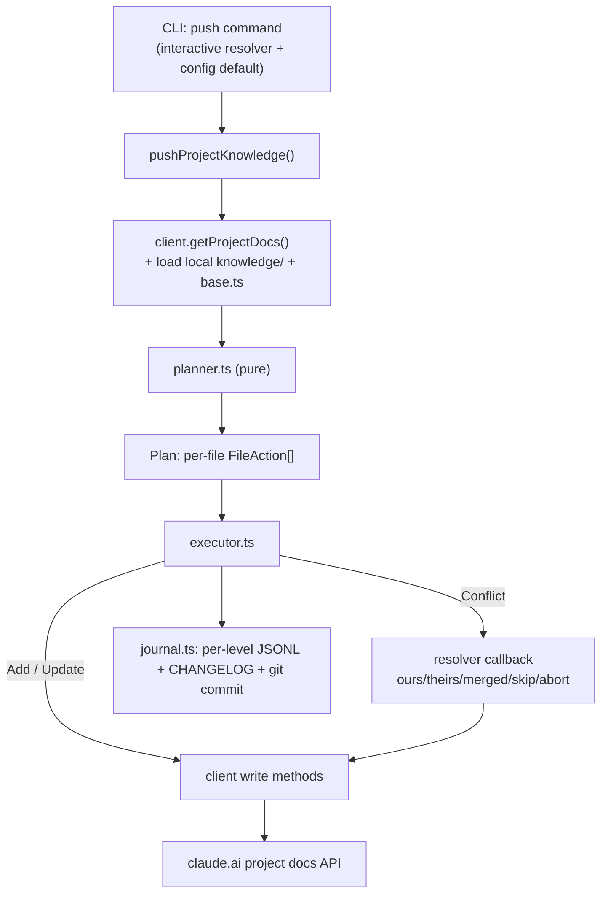
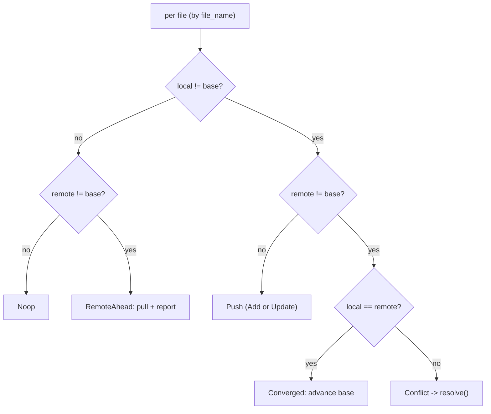

# Write-Back Sync: Project Knowledge -> claude.ai

- **Date:** 2026-06-28
- **Status:** Approved design (pre-implementation)
- **Scope:** Core SDK + CLI. First write path from local back to claude.ai.

## 1. Context and Motivation

ClaudeSync is read-only today: it pulls conversations, artifacts, and project
knowledge from the undocumented claude.ai web API to local disk. This design adds
the first **write-back** path -- pushing locally-edited **project knowledge docs**
back up to claude.ai -- to unblock ecosystem-wide agentification (agents editing a
project's knowledge base locally and syncing it up).

Scope is deliberately narrow: project knowledge docs only. Conversations,
artifacts, and uploaded project files are out of scope for v1.

## 2. Ground-Truth Findings

Investigated against the current SDK and the canonical reverse-engineering in
`jahwag/ctxsync` (`src/ctxsync/providers/base_claude_ai.py`).

### 2.1 The SDK has no write primitive

`ClaudeSyncClient.request()` / `requestRaw()` are hardcoded `GET`
(`fetch(url, { headers })`, no method/body). Write-back requires generalizing the
request path to take a method + JSON body. This is the only change outside the new
module.

### 2.2 The claude.ai project-knowledge doc API

| Operation | Method | Path | Body |
|-----------|--------|------|------|
| List | GET | `/api/organizations/{org}/projects/{p}/docs` | -- |
| Add | POST | `/api/organizations/{org}/projects/{p}/docs` | `{ file_name, content }` |
| Delete | DELETE | `/api/organizations/{org}/projects/{p}/docs/{doc_uuid}` | -- |

- **There is no update/PUT for docs.** Editing a doc = delete the old uuid + add a
  new one. (The only PUT is for project metadata, not docs.)
- Writes require **only** the `sessionKey` cookie + `Content-Type: application/json`.
  **No CSRF / Origin / Referer token.** The existing `AuthProvider.getHeaders()`
  already supplies the cookie and browser-like headers.

### 2.3 Doc model constraints

- Docs are **immutable, uuid-keyed, and carry no version/etag** -- only `created_at`.
  Divergence cannot be detected from a remote version; we must synthesize a base.
- `file_name` is **not guaranteed unique** on claude.ai (flat uuid-keyed list).
- `delete + add` is **non-atomic** -- naive ordering risks data loss.

### 2.4 Current local layout and state

- Knowledge docs materialize to `knowledge/<file_name with "/" -> "_">` under the
  project root (`packages/core/src/sync/project-sync.ts`). The flatten is lossy.
- `.claudesync-state.json` is written **per conversation directory**
  (`packages/core/src/sync/state.ts`) and tracks conversation leaves + artifacts.
  **It does not track project knowledge docs.**
- The pull path writes a human `CHANGELOG.md` per conversation. Project knowledge
  has no changelog, and nothing records actions taken *against the remote*.

## 3. Decisions

1. **Base source = git-when-available, else state hash.** Detect divergence by
   comparing content hashes. The base hash comes from the git-HEAD blob of the
   knowledge file when the file is git-tracked; otherwise from the per-level
   knowledge manifest recorded at last sync. Base is used for **detection only** --
   resolution is 2-way (local vs remote), so a hash from either source suffices.
2. **Conflict policy = pull + resolve.** On a true conflict, fetch remote and
   resolve via a strategy: interactive, or a config-driven default. Strategies:
   `ours`, `theirs`, `merged`, `skip` (a.k.a. `ignore`), `abort`. The chosen
   resolution is committed to **both** sides (push to remote when it wins; write to
   the working tree + git commit so local and base converge).
3. **Deletions are conflicts too.** A locally-deleted-but-remote-present doc (or
   the reverse) routes through the same resolve flow. v1 never auto-deletes remote
   content.
4. **Entry point = a new dedicated SDK call + CLI command.** The read/pull path is
   untouched; write-back is explicit and opt-in.
5. **Architecture A now, B as the north star.** Build a standalone planner/executor
   module now (Approach A). Shape it so a future `ClaudeSink implements SinkSurface`
   (Approach B) can call the same reconcile core -- documented future refactor,
   not built in v1.

## 4. Architecture

New isolated concern: `packages/core/src/writeback/`.

| Unit | Responsibility | IO |
|------|----------------|----|
| `planner.ts` | Pure. `(remoteDocs, localFiles, base) -> Plan` of per-file actions. | none |
| `executor.ts` | Applies the Plan via the client; routes conflicts to the resolver; converges both sides; writes the journal. | yes |
| `base.ts` | Resolve a per-file base content-hash: git-HEAD blob if tracked, else manifest hash. | git/fs |
| `journal.ts` | Append per-level audit records; format git commit messages. | fs/git |
| `types.ts` | `Plan`, `FileAction`, `KnowledgeConflict`, `Resolution`, `WritebackOptions`, `WritebackResult`. | -- |
| `index.ts` | Barrel + `pushProjectKnowledge(...)` entry point. | -- |

The planner is pure and fully unit-testable. The executor is the only unit that
touches the network, git, and disk. Core stays **non-interactive**: the interactive
resolver is an injected callback supplied by the CLI.



### 4.1 Client write primitive (the one change outside the module)

- Generalize the private request path to accept an optional `{ method, body }`,
  adding `Content-Type: application/json` when a body is present. Keep the existing
  paced/limited path and 429 handling.
- Add `ENDPOINTS.projectDoc(org, project, docUuid)` for the DELETE path.
- Add public methods:
  - `createProjectDoc(org, project, { file_name, content }): Promise<ProjectDoc>`
  - `deleteProjectDoc(org, project, docUuid): Promise<void>`
- Full TSDoc per the project convention.

## 5. Reconcile Model

Files are matched by `file_name` (preserving nested paths -- see section 8). Let
**B** = base hash, **L** / **R** = local / remote content. Base is used only to
detect divergence.

| local vs base | remote vs base | Action |
|---|---|---|
| unchanged | unchanged | Noop |
| changed | unchanged | Push (new file -> Add; existing -> Update) |
| unchanged | changed | RemoteAhead -> pull into working tree, report (no push) |
| changed | changed, `L == R` | Converged -> Noop, advance base |
| changed | changed, `L != R` | Conflict -> resolve |
| local deleted | remote exists | Conflict |
| local new | remote absent | Add |
| local absent | remote new | pull, report |



### 5.1 Identity and round-trip

A per-level knowledge manifest (co-located with the level's state sidecar, see
section 7) records `{ doc_uuid, rel_path, content_sha256 }` per doc at last sync.
This is both the **state-base hash** and the precise **local-file -> remote-uuid
map**, so Update/Delete target the correct uuid.

If the remote has **duplicate `file_name`s** that the manifest cannot disambiguate,
those files are forced to `Conflict` and never blindly deleted.

### 5.2 Base resolution precedence

1. If the local knowledge file is git-tracked and a HEAD blob exists ->
   `base = sha256(HEAD blob content)`.
2. Else if the manifest has an entry -> `base = manifest.content_sha256`.
3. Else (no base) -> the file is treated as `local new` (Add) or, if the remote has
   it, a `Conflict` (cannot prove non-divergence).

## 6. Conflict Resolution

When the planner emits a `Conflict`, the executor invokes the resolver to obtain a
`Resolution`. Non-interactive runs use the configured default strategy.

| Strategy | Remote effect | Local effect |
|----------|---------------|--------------|
| `ours` | push local (delete old uuid + add new) | commit local as-is |
| `theirs` | none | write remote content to working tree + commit |
| `merged` | push merged content | write merged content + commit |
| `skip` / `ignore` | none | none; mark unresolved, **continue** with other files |
| `abort` | none | none; **halt the whole run** (safe prior changes remain) |

- `skip` vs `abort`: `skip` passes over one file and keeps going (for batch/cron);
  `abort` stops the entire run.
- The resolver is a callback: `resolveConflict(c: KnowledgeConflict) ->
  Promise<Resolution>`. The CLI supplies an interactive implementation (2-way diff
  of local vs remote, prompt for choice / hand-merge). Core ships only the
  config-default resolver.

## 7. Auditability

Every write-back action against the remote is recorded durably and is queryable by
glob or file path. Three complementary layers.

### 7.1 Structured journal (machine-queryable)

A `.claudesync-writeback-log.jsonl` sidecar, **append-only**, written **per
directory level**, co-located with that level's `.claudesync-state.json` so no single
log grows unbounded and each log is scoped to its own level's files. One record per
completed action:

```jsonc
{ "ts": "2026-06-28T19:04:11Z", "run_id": "a1b2c3", "trigger": "cron",
  "dry_run": false, "rel_path": "style/voice.md", "action": "update",
  "resolution": "theirs", "resolver": "config-default:theirs",
  "base_source": "git", "doc_uuid_before": "...", "doc_uuid_after": "...",
  "local_sha256": "...", "remote_sha256_before": "...", "result_sha256": "...",
  "ok": true, "error": null }
```

Query examples:

```sh
jq 'select(.rel_path | test("style/"))' .claudesync-writeback-log.jsonl
jq 'select(.action == "delete" or .resolution == "ours")' **/.claudesync-writeback-log.jsonl
```

`action` values: `add`, `update`, `delete`, `conflict`, `skip`. The JSONL contract
is stable so future UI/CLI tooling can read it directly.

### 7.2 Human CHANGELOG

A project-knowledge `CHANGELOG.md` (reusing the existing append/preserve machinery
in `sync/changelog.ts`): dated, newest-first, "Pushed / Pulled / Conflict-resolved
(theirs) / Skipped" sections, for eyeball scanning.

### 7.3 Git history (strongest layer)

Because resolutions are committed to the working tree, every `knowledge/<file>`
change -- plus the JSONL log and CHANGELOG -- lands in a git commit with a
structured message:

```
writeback(my-project): update 3, conflict-resolve 1 (theirs), skip 1 [run a1b2c3]
```

Native by-glob / by-path queries:

```sh
git log -p -- 'knowledge/**'          # full before/after diffs + when + why
git log -- knowledge/style/voice.md   # one file's entire write-back history
```

### 7.4 Cron-clobber safety rail

- **Shipped default resolution = `skip`, never `ours`/`theirs`.** A naive cron
  cannot silently overwrite remote -- it skips conflicts and logs them. Auto-
  overwrite is strictly opt-in (e.g. `--on-conflict theirs`).
- Each run prints a **summary + the log path** and signals when conflicts were
  skipped (so cron output/email shows "3 conflicts skipped -- see log").
- `--dry-run` writes the planned actions to the JSONL with `"dry_run": true` (and
  makes no network writes), so the plan can be audited before arming automation.

## 8. Execution Safety

- **Update ordering: add-new-first -> verify 200 + new uuid -> delete-old-uuid.**
  Never delete before add. Worst case on partial failure is a transient duplicate
  `file_name` (reconciled next run), never lost content.
- **Retry policy:** `POST` add is non-idempotent -> **no blind auto-retry on add**;
  on failure, record + report and let the next run converge by `file_name` + hash.
  `DELETE` by uuid is retry-safe (a gone uuid -> 404 -> treat as done).
- **Plan order: all safe Adds/Updates first, conflicts last** -- a mid-run `abort`
  leaves the safe changes applied + logged, conflicts untouched.
- All writes ride the **existing paced/limited request path** (429 -> backoff,
  shared limiter), so write-back participates in the same backpressure.
- One journal record is appended per completed action (success or caught error);
  the add-before-delete ordering is the data-loss guard, the journal is the witness.

## 9. Scope and Layout

- **In scope (v1):** project knowledge docs only; one project per
  `pushProjectKnowledge` call (multi-project = caller loop).
- **Out of scope (v1):** conversations, artifacts, uploaded project files; mirroring
  remote deletions automatically; the `json` export format.
- **Layout change:** write-back **preserves nested `file_name` structure as real
  subdirectories** (today's read path flattens `/` -> `_`). Read and write paths are
  aligned to the same nested layout. This is what creates the directory "levels"
  across which the per-level state + journal sidecars are spread.
- Requires a `knowledge/` directory layout (git or files format) and reuses the
  existing `AuthProvider` (writes add only `Content-Type`).

## 10. Error Handling

- `429` -> existing `RateLimitError` + limiter backoff.
- Per-file write failures are collected and reported; one file's failure does not
  abort the run (except a fatal like auth failure). Each failure is journaled with
  `ok: false` and the error.
- Duplicate-`file_name` ambiguity -> `Conflict`, reported, never a blind delete.
- A non-git working tree disables the git base + git-commit layer; the run falls
  back to the manifest base and still writes the JSONL + CHANGELOG.

## 11. Testing Strategy

Vitest, synthetic fixtures, no real PII.

- **Planner (pure):** the full decision table across local/remote/base permutations,
  including deletions, converged, duplicate-`file_name`, and no-base cases.
- **Executor (mock client):** add-before-delete ordering; conflict routing; resolver
  invocation; journal records emitted; dry-run performs no network writes; plan
  ordering (safe-first, conflicts-last); abort preserves prior safe changes.
- **Client writes:** `request()` generalization (method/body/content-type) and
  `createProjectDoc` / `deleteProjectDoc` happy + error paths, `fetch` mocked.
- **Strategies:** `ours` pushes + commits; `theirs` pulls + commits; `merged` pushes
  hand content; `skip` leaves both sides untouched + logs; `abort` halts with safe
  changes preserved.
- **Auditability:** per-level JSONL placement, append-only behavior, record shape,
  and git commit message format.

## 12. Future Work

- **Approach B refactor:** fold planner/executor behind a `ClaudeSink implements
  SinkSurface` so claude.ai becomes a writable sink, symmetric with the file sink,
  enabling full bidirectional sync across item kinds.
- `--mirror-deletes` flag to opt into auto-deleting remote docs absent locally.
- Extend write-back to conversations / uploaded project files.
- A `writeback log <glob>` CLI verb if `jq` + `git log` prove clumsy in practice.
- `json` export format support.

## 13. Open Questions

None blocking. The interactive resolver UX detail (diff rendering, hand-merge entry)
is a CLI-layer concern resolved during CLI implementation, not a core-design blocker.
